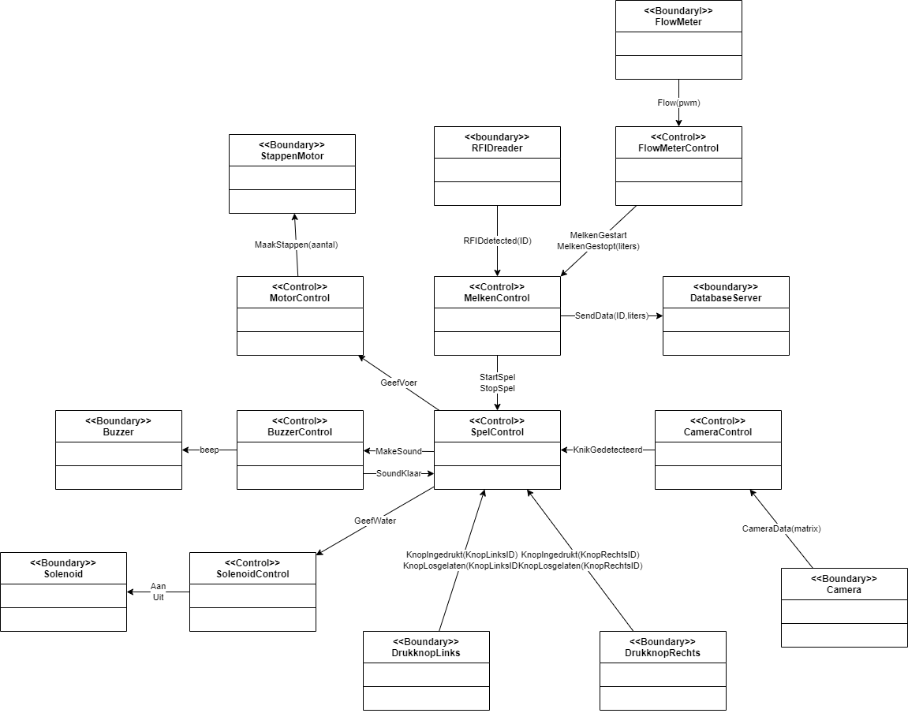

# Slimme Veestal
### Bij dit verbeterproject word er een slimme veestal gemaakt aan de hand van de volgende 2 use case omschrijvingen.
## Use case omschrijvingen
UC1: Als een koe door het ingangspoortje loopt, wordt de koe geidentificeerd, gemolken en
wordt de melkproductie van die koe gemeten en naar een server gestuurd.

UC2: Tijdens het melken wordt de Koe geentertained met een spelletje: Het begint na een
knik van zijn kop: Er klinken 3 piepjes. Binnen 1 seconde na het derde piepje moet de koe
een van zijn beide voorpoten (opnieuw) neerzetten. Als het de linkerpoot is, wordt er een
portie droogvoer in een bak voor hem gedeponeerd. Als het de rechterpoot is, wordt een
waterbak wat bijgevuld.
### Aan de hand daarvan zijn de volgende use case diagrammen opgesteld
## Use case diagram
| Naam           | ``UC01 - melken`    |
| --------- | -------------- |
| Actor          |``koe, gebruiker``     |
| Samenvatting   | ``De koe wordt gedetecteerd, gemolken en gegevens worden naar de server gestuurd``  |
| Preconditie    | ``Er word op dit moment geen koe gemoleken``|
| Scenario       | ``1. Het systeem detecteert de aanwezigheid van de koe en wordt geïdentificeerd via een RFID-chip`` |
|                | ``3. De flowmeter detecteert dat er gemolken word`` |
|                | ``4. Het trainingsspelletje word gestart (zie UC02)`` |
|                | ``5. De melkproductie van de koe wordt gemeten.`` |
|                | ``6. De gemeten gegevens worden naar de server gestuurd.`` |
|                | ``7. Het melken is klaar`` |
| Postconditie   | ``Er word geen koe gemolken`` |
| Uitzonderingen | ``De koe kan niet worden geidentifiseerd: de gebruiker word gewaarschuwd``|

| Naam           | ``UC02 - spelletje``    |
| --------- | -------------- |
| Actor          |``koe``     |
| Samenvatting   | ``Tijdens het melken wordt de Koe geentertained met een spelletje``  |
| Preconditie    | ``UC1 is actief en start UC2``|
| Scenario       | ``1. Het systeem detecteert een knikje van de koe`` |
|                | ``2. Het systeem laat 3 piepjes horen`` |
|                | ``3. Binnen 1 seconden moet de koe een poot opnieuw neerzetten anders terug naar stap 1`` |
|                | ``4. Het systeem detecteert welke poot word opgetilt (ga naar 5 voor links en naar 6 voor rechts)`` |
|                | ``5. Deponeer droogvoer in voerbak`` |
|                | ``6. Vul de waterbak bij`` |
|                | ``7. Ga terug naar stap 1`` |
| Postconditie   | `` `` |
| Uitzonderingen | ``Als de koe klaar is met melken stopt het systeem``|
### Vervolgens is het volgende object model gemaakt
## Object model

### En het bijbehorende klassediagram met listner patern
## Klasse diagram

### Vervolgens is daar deze STD uit gekomen
## STD

### Uiteindelijk is daar code uit gemaakt en die is te vinden in de volgende bestanden
## Code
[Melken](./MelkenControl.hpp) en [Spel](./SpelControl.hpp)
