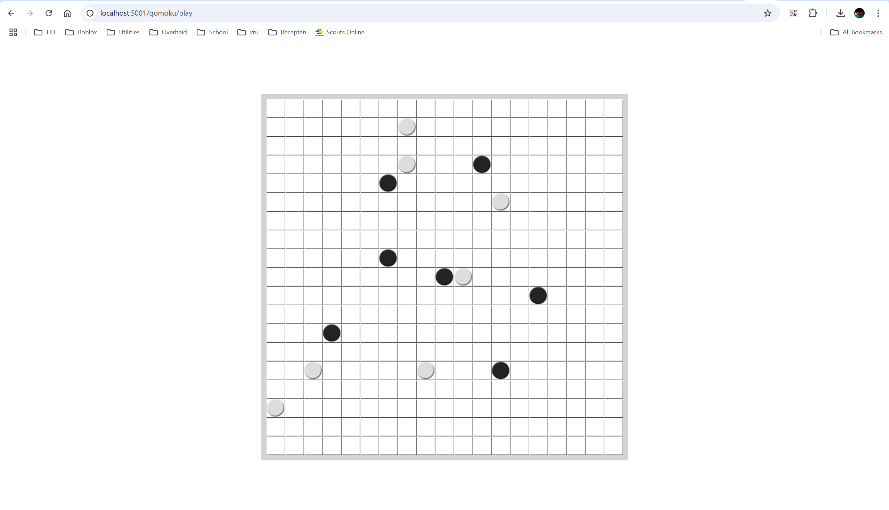
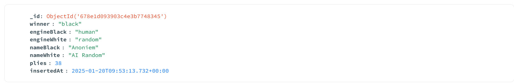

# Ontwikkelserver met Webapplicatie
opdracht Ontwikkelserver met Webapplicatie.
## Logboek
Het logboek van het opzetten van de server: [logboek](Logboek.md)
## midgame screenshot

## database screenshot

De winnaar, manier van spelen (AI of mens), namen, aantal stenen en timestamp worden opgeslagen
## werking flask app
Eerst worden allemaal dingen geinitialiseerd (zoals de mongodb).
De app heeft verschillende routes met aanspreekmethoden (dus waar de endpoint te vinden is en of je een post request kan doen)
Aan de hand van wat aangeroepen word krijg je op de client een reactie terug
## Werking docker en docker compose
### docker file van de python app
Eerst word de python versie geselecteerd een een werkdirectory gemaakt. Daarna worden de requirements gemaakt. waarna de code wordt gekopieerd naar de workdirectory en de app word gestart.
### docker compose file van de hele app
In de services staan alle containers die je wilt gebruiken en bij networks kan je netwerken maken (word nu een netwerk gemaakt voor deze app).
Alle containers hebben hun eigen instellingen, bij mongo worden de volgende dingen ingesteld.
- De container word gekoppeld aan het netwerk
- De inage word geselecteerd (kan op basis van naam of van een folder met docker file)
- De naam van de container word ingesteld
- De restart policy
- De omgevingsvariabelen (kan ook gedaan worden met evn file [env_file:])
- Met ports kan je poorten open zetten naar de buitenwereld (met expose kan je zorgen dat poorten onderling gebruikt kunnen worden)
- Met volumes kan je opslag van je apperaat koppelen aan een folder in de container
- Wat hier niet word gebruikt is depend_on, daarmee kan je zorgen dat een container wacht op een ander container.
## Page Design Model
Dit geeft een uitleg van wat het systeem moet doen en hoe het er uit ziet. Er staat een klein plaatje hoe de pagina er uit moet zien en de workflow van de website. er staat ook welke dingen worden aangepast tijdens het spelen. Ook is de dataopslga vermeld.