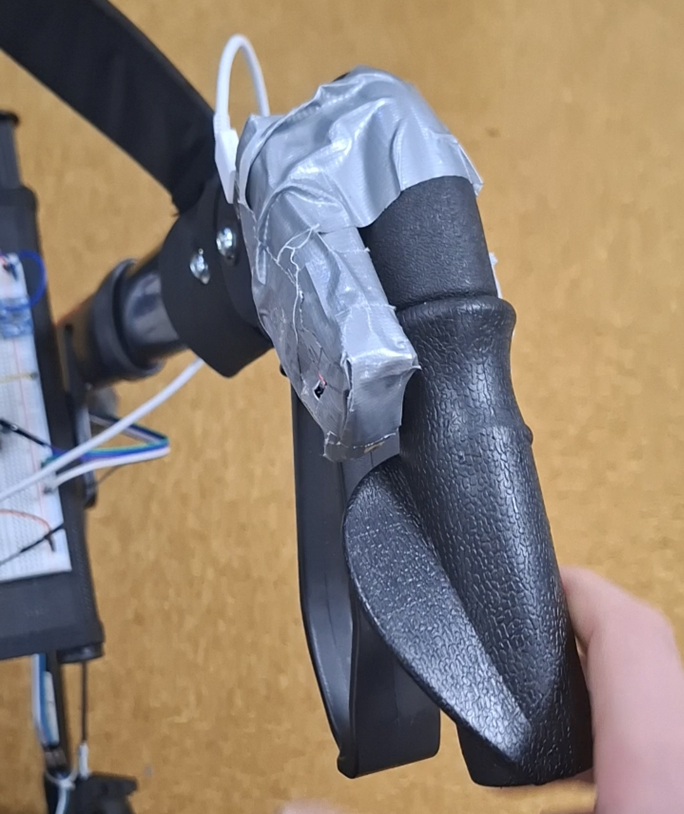

# Upgrade-opdracht harstlagsensor
Door Fabian Meerveld

# Inleiding
Het doel van dit onderzoek is om te bepalen welke hartslagsensor het meest geschikt is voor integratie in het rollatornavigatorproject. Bij het project word de gezondheid van de gebruiker in de gaten gehouden om de nodige inzichten te krijgen. De juiste hartslag sensor is hiervoor zeer belangrijk.

# Vooronderzoek en Theoretisch kader
Galli, A., Montree, R. J. H., Que, S., Peri, E., & Vullings, R. (2022). An Overview of the Sensors for Heart Rate Monitoring Used in Extramural Applications. Sensors, 22(11), 4035. https://doi.org/10.3390/s22114035

Turing Lab Hardware Shop. (z.d.). https://hu-hbo-ict.gitlab.io/turing-lab/ti-lab-shop/

Wikipedia contributors. (2024, 20 september). Heart rate monitor. Wikipedia. https://en.wikipedia.org/wiki/Heart_rate_monitor

Brb. (2024, 11 augustus). Het hart - Biologielessen.nl. Blueprint Website. https://biologielessen.nl/het-hart/

# Hoofdvraag
Welke sensor is het meest geschikt om de hartslag van een gebruiker nauwkeurig te detecteren tijdens het gebruik van een rolator?

# Deelvragen
Om de hoofdvraag te beantwoorden is er eerst een antwoord nodig op de volgende deelvragen
- Wat is de toepassing van de hartslagsensor bij het gebruik van de rolator?
- Welke type hartslagsensoren zijn er?
- Wat zijn de eigenschappen van de type hartslagsensoren?
- Welke hartslagsensor is het meest geschikt voor het nauwkeurig detecteren van de hartslag bij het gebruik van de rolator?
- Welke technieken zijn nodig om het signaal van de sensor te verwerken?

# Methoden 
## Wat is de toepassing van de hartslagsensor bij het gebruik van de rolator?
Gesprek met specialist en stakeholder.

## Welke type hartslagsensoren zijn er?
Bronnenonderzoek.

## Wat zijn de eigenschappen van de type hartslagsensoren?
Bronnenonderzoek

## Welke hartslagsensor is het meest geschikt voor het nauwkeurig detecteren van de hartslag bij het gebruik van de rolator?
Bronnenonderzoek, datasheet.

## Welke technieken zijn nodig om het signaal van de sensor te verwerken?
Bronnenonderzoek, datasheet.

# Bevindingen
## Wat is de toepassing van de hartslagsensor bij het gebruik van de rolator?
Bij de rolator word de gebruiker gepromoot om meer te bewegen, uit onderzoek is gebleken dat mensen die meer bewegen minder snel ziek worden (Lucie, 2024). Om daar inzicht bij te krijgen is een hartslagsensor van groot belang.

## Welke type hartslagsensoren zijn er?
Er zijn volgens pmc verschillende soorten hartslagsensoren, die elk op hun eigen manier de hartslag detecteren. De eerste manier is op basis van elektrische activiteit, het hard word aangestuurd door middel van kleine stroomschokjes en die kunnen gemeten worden. Deze sensor werkt met electrodes en kan op verschillende manieren worden aangesloten.

De hartslag kan ook door middel van licht gemeten worden, doordat de hartslag een puls effect heeft kan het bloed volume in de huid gemeten worden want die veranderd. Deze sensor werk met LED en Photodetector.

De hartslag kan ook gemeten worden door de beweging (trillingen te meten). Deze methode werd heel lang geleden ontdekt maar bijna nooit gebruikt omdat deze niet heel acuraat is. Hiervoor word een Accelerometer of gyroscoop gebruikt. 
(Galli et al., 2022)

## Wat zijn de eigenschappen van de type hartslagsensoren?
Elke soort hartslagsensor heeft zijn eigenschappen.
Elektrisch: Direct contact met lichaam, neemt veel ruimte in beslag, kost vaak meer, makkelijke dataverwerking, heel erg acuraat
Licht: Kan zonder contact met lichaam, kleine voetprint, goedkoop, dataverwerking moeilijkheid gemiddeld, redelijk acuraat.
Mechanisch: Geen direct contact met lichaam, compact, weinig documentatie, moeilijk om data te verwerkten, niet heel accuraat.

## Welke hartslagsensor is het meest geschikt voor het nauwkeurig detecteren van de hartslag bij het gebruik van de rolator?
Na de vorige deelvragen past de hartslagsensor met licht het beste binnen de toepassing. In het TI lab zijn de volgende licht hartslagsensoren beschikbaar: max30100, ky039, MAX30102.

De ky039 werkt heel simpel maar neemt veel ruimte in beslag.
De MAX30102 is compact en heeft ook nog veel andere functies zoals bloedzuurstof meten en werkt met het I2C protocol. Deze is ook goed op vooraad.
De max30100 lijkt op de MAX30102 maar is iets groter, deze werkt ook met I2C.

## Welke technieken zijn nodig om het signaal van de sensor te verwerken?
Om het signaal van de hartslagsensor te verwerken tot een hartslag kan er gekeken worden naar het hoogste en laagste punt. De tijd tussen de dalen of toppen laat de frequentie zien.
 

# Conclusie
Er zijn verschillende soorten hartslagsensoren die allemaal hun eigen techniek hebben. Ze werken op basis van electrische activiteit, licht of mechanische beweging. Binnen het project past de hartslagsensor op licht het beste omdat deze compact is en ook werkt als je beweegt. De MAX30102 is een optische hartslagsensor die goede documentatie heeft en op vooraad is. Ook is het signaal makkelijk te verwerken. Dit is dus de best beschikbare hartslagsensor voor de rolator.

# Implementatie
De MAX30102 is toegevoegd aan de rolator en geeft goede resultaten. 

# Aanbevelingen
De volgende aanbeveling is er voor de hartslagsensor: Onderzoek of de sensor in het handvat verwerkt kan worden voor meer gebruikscomfort.