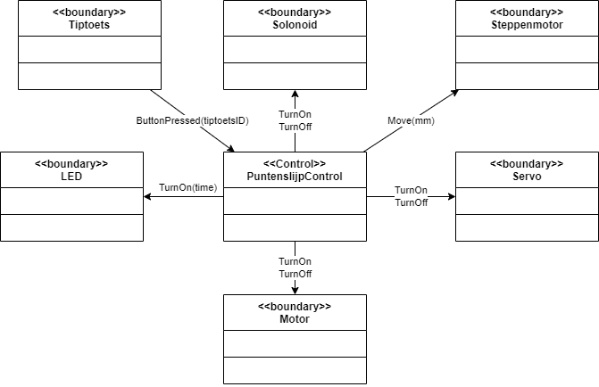

# Opdracht automatische puntenslijper
## Use case uitleg
volautomatisch puntenslijper, je stopt de potloot er n, servo grijpt potlood vast, wormwiel beweegt potlood tegen tiptoets, weer ites naar achter, tiptoets gaat met solonoid opzij, wormwiel beweegt weer naar voren. dan nog verder tot achteraan waar de slijper zit. slijpern en dan weer naar achter en punt meten met tiptoets (die is weer terug). ALs het potlood op is dan gaat er een rood lampje branden.

5 sec om te slijpen
## Use case omschrijving
| Naam           | ``UC01 - Punt slijpen`` |
| -------------- | --- |
| Actor          | ``Gebruiker`` |
| Samenvatting   | ``Een systeem die een potloot slijpt totdat die een perfecte punt heeft.`` |
| Scenario       | ``1. De gebruiker doet de potloot in de slijper`` |
|                | ``2. De tiptoets detecteert de potlood (die drukt tegen de toets)`` |
|                | ``3. De servo grijpt de potlood vast `` |
|                | ``4. De wormwiel beweegt de potlood 1 mm naar achter`` |
|                | ``5. De wormwiel beweegt de potlood net zo lang naar voren totdat de tiptoets word ingedrukt`` |
|                | ``6. De wormwiel beweegt de potlood 1mm naar achter`` |
|                | ``7. De solonoid wordt geactiveerd en de tiptoets beweegt opzij`` |
|                | ``8. De motor van de slijper word gestart`` |
|                | ``9. De wormwiel beweegt langzaam 12mm naar voren`` |
|                | ``10. De motor van de slijper wrod uitgezet`` |
|                | ``11. De wormwiel beweegt 12 mm naar achter`` |
|                | ``12. De solonoid wordt gedeactiveerd`` |
|                | ``13. De wormwiel meet hoever die naar voren moet bewegen totdat de tiptoets word ingedruk`` |
| Invariant      | ``14. Als de afstand kleiner is dan 1.1mm dan word de potloot uitgeworpen anders ga naar stap 6`` |
| Postconditie   | ``De potlood heeft een goede punt`` |
| Uitzonderingen | ``De potlood is te kort en de wormwiel kan niet 12mm naar voren bewegen: rood lampje gaat branden en potlood wordt uitgeworpen`` |
## Object model
### Object omschrijving
| Object naam         | Stereotype | Beschrijving                                                       |
|---------------------|------------|-------------------------------------------------------------------|
| PuntenslijpControl  | Control    | "Dirigent" van use case "punt slijpen"                              |
| Tiptoets            | Boundary   | Tiptoets om de punt van de potlood te detecteren                   |
| Solonoid            | Boundary   | Solonoid die de tiptoets aan de kan kan halen                      |
| Steppenmotor        | Boundary   | Steppenmotor om wormwiel te bedienen                               |
| Servo               | Boundary   | Servo met grijper om potlood vast te pakken                        |
| LED                 | Boundary   | Led om aan te geven dat potlood te kort is                         |
| Motor               | Boundary   | Motor die de slijper laat draaien                                  |
| WormwheelControl    | Control    | Controleert de beweging van het wormwiel                           |
| GrabberControl      | Control    | Controleert de grijper om het potlood vast te pakken of los te laten |

### Object model

